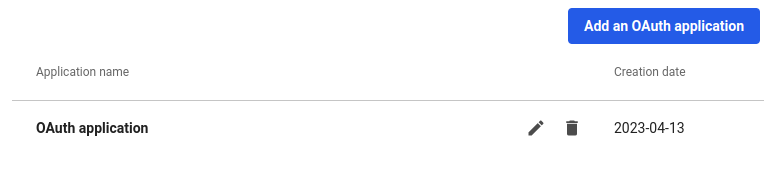
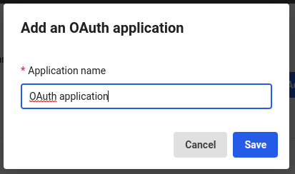
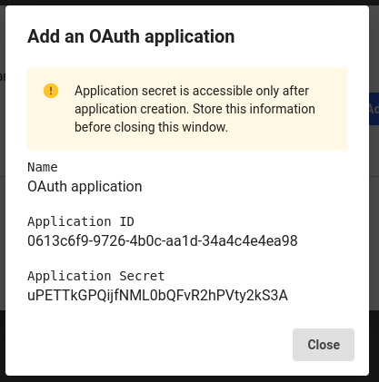
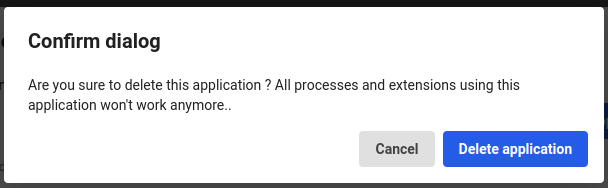

# Provide a UI to let LumApps customer global admin create and manage LumApps Oauth application used by an extension

## Tags
`global_settigns`, `oauth_application` 

## Purpose of this sample
This sample provide developers with an interface to ease the OAuth application creation for a customer administrator from the extension global settings.
The administrator can create and edit an application, and remove the application.
The UI is translated in English and French.

To be fully integrated with your extension you may have to save the application information on your side to easily retrieve the application token to reach LumApps API.

## Screenshots
| Component      | Screenshot                                                   |
| -------------- | ------------------------------------------------------------ |
| Application list         |           |
| Create the application       |         |
| See client secret       |         |
| remove the application & the technical account       |         |