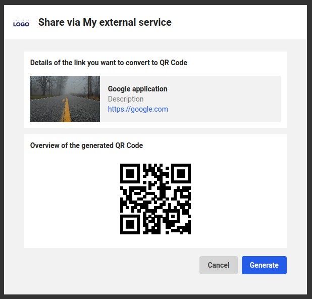
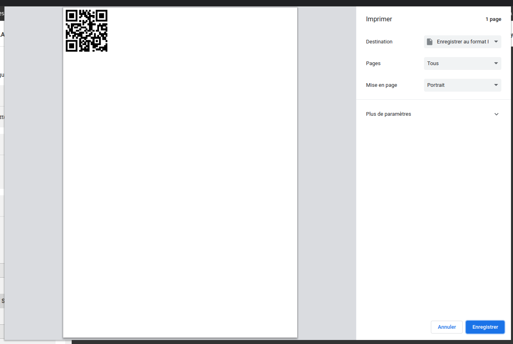

# Print a QR code containing a link to a post or a content

## Tags
`share`, `qr_code` 

## Purpose of this sample
This extension let the user share a content or a post into a QR Code and print this QR Code.

## Screenshots
| Component            | Screenshot                                            |
| -------------------- | ----------------------------------------------------- |
| Share Dialog content |    |
| Printing interface   |  |