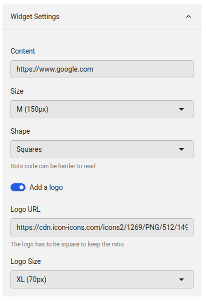

# Display a QR Code in a Widget

## Tags
`widget`, `qr-code` 

## Purpose of this sample
This widget display a QR Code from a content define in the widget settings.
This widget uses the WidgetSettings component to set up the QR Code to display in the Widget component.

## Screenshots
| Component   | Screenshot                                                   |
|-------------|--------------------------------------------------------------|
| Widget      |                 |
| Widget Dark |  |
| Settings    |               |
