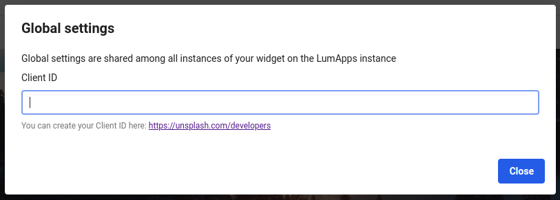

# Display an image in a Widget from Unsplash free photo and image stock

## Tags
`widget`, `image` 

## Purpose of this sample
This widget display an image from the [Unsplash](https://unsplash.com/) API.
This widget uses the WigetSettings component to search and define the image to display in the Widget component, and the WidgetGloablSettings component to set up the API Client ID to reach the Unsplash API.

## Screenshots
| Component                      | Screenshot                                                                           |
| ------------------------------ | ------------------------------------------------------------------------------------ |
| Widget                         |                                        |
| Settings                       |                                      |
| Settings - Image search dialog |  |
| GlobalSettings                 |                        |