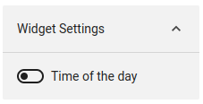

# Display a welcome message

## Tags
`widget`, `welcome` 

## Purpose of this sample
This widget display a welcome message with the name of the user.

## Screenshots
| Component     | Screenshot                                                                    |
| ------------- | ----------------------------------------------------------------------------- |
| Widget        |                                  |
| Widget (Dark) |                        |
| Settings      |  |